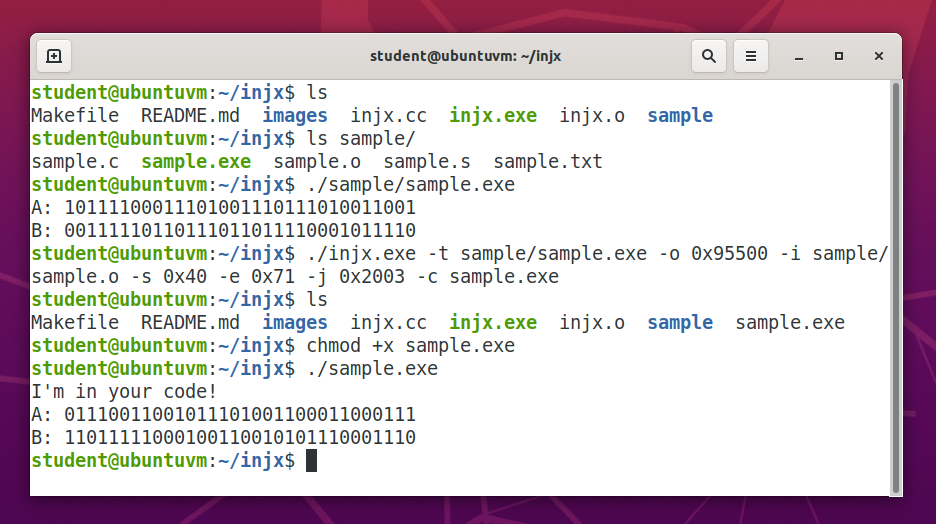

# **injx**

### **Table of Contents**

* [Summary](#summary)
* [Usage](#usage)
* [Example](#example)
* [Credits](#credits)

### **Summary**

Injx is a tool to inject machine code into x86 executables. It can also be used to copy files and move around sections of bytes. 

### **Usage**

##### **Compiling**

To compile the program using Make, run `make` from your shell in the directory of the project. 

##### **Running**

To run the program, use `./injx.exe <options>`

The command line options are: 
* [-t | --target] <filename> [Req] – File or file path to inject into 
* [-o | --offset] <offset>   [Req] – File offset (hex or decimal) at which to inject in target file
* [-i | --inject] <filename> [Req] – File of file path from which to inject
* [-s | --start]  <offset>   [Opt] – File offset (hex or decimal) to start from inject file, else beginning of file
* [-e | --end]    <offset>   [Opt] – File offset (hex or decimal) to end from inject file, else end of file
* [-c | --copy]   <filename> [Opt] – Copy target file into new file or file path, else modify target file directly
* [-j | --jump]   <offset>   [Opt] – Set an x86 jump to the injected data at the given offset (hex or decimal)
* [-h | --help]              [Opt] – Print help about using injx, then exit

##### **Tips**

To determine the offsets to inject to and from, I recommend inspecting the target and inject files using the `objdump` tool. For example, `objdump -srxRFD <infile.exe> > <outfile.txt>` will allow you to inspect the disassembly, file offsets, and section headers. 

To jump to and execute injected code, the code but the jump offset and injection offset should be in executable sections of the executable to avoid crashing (look at the section headers in objdump). In addition, you probably want to place the jump at the end of a function call and place a `retq` instruction (opcode 0xC3) at the end of your injected code to so it will jump back to the original application code. The jump is encoded with a `jmp rel32` (opcode 0xE9) x86-64 instruction. 

I tested this on Ubuntu with x86-64 and ELF executables, I'm not sure how well it will work on other platforms. 

### **Example**

The `sample/` directory contains two files `sample.c` and `sample.s`. `sample.s` makes a system call to print "I'm in your code!". `sample.c` is a simple, useless program that does some bit manipulation and I/O. We will inject some of the machine code produced by `sample.s` into the executable produced by `sample.c`. 

First, compile the two files with `gcc -falign-functions -o sample/sample.exe sample.c` and `gcc -c sample/sample.s`. Run `./sample/sample.exe` and observe the output. If you inspect `sample.o` with `objdump`, you will see that the file offset for the machine code we want starts at 0x40 and ends at 0x69. If you inspect `sample.exe` with `objdump`, you will notice that the executable section of the code is from offset 0x1000 to 0x2000. Starting around 0x1600, there is empty space, so this is a good place to insert our code from `sample.o`. You will also notice that the function `Pair32_init()` returns at offset 0x1600, so this is a good place to insert our jump, as our injected code will return to the main application. Run injx with `./injx.exe -t sample/sample.exe -o 0x1600 -i sample/sample.o -s 0x40 -e 0x71 -j 0x1473 -c sample-copy.exe`. Now make the copy executable with `chmod +x sample-copy.exe` and run `./sample-copy.exe`. You should observe that the code we injected prints to the shell. I have included an image of a sample shell session below to demonstrate this. 

### **Credits**

Developer and Creator – Forrest Feaser [@fdfea](https://github.com/fdfea)

